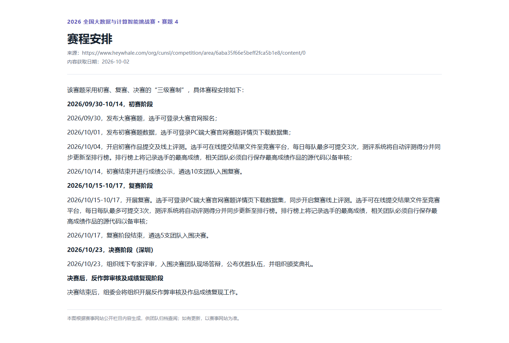
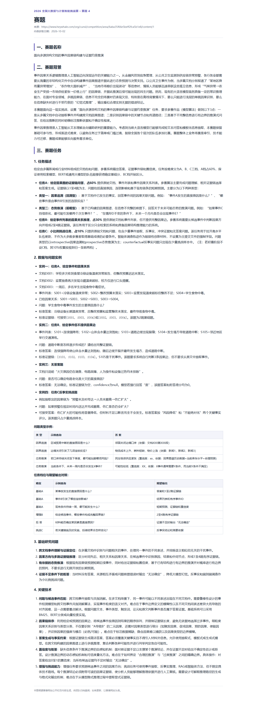
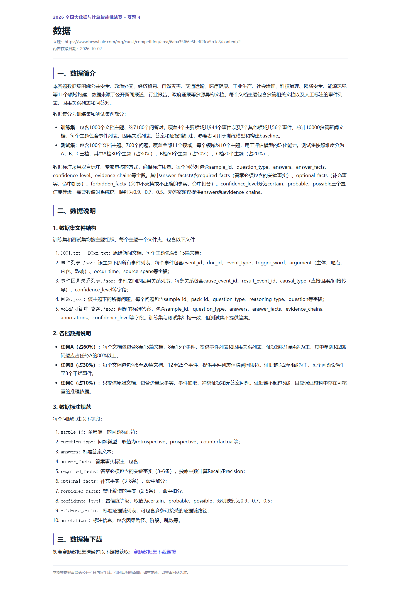
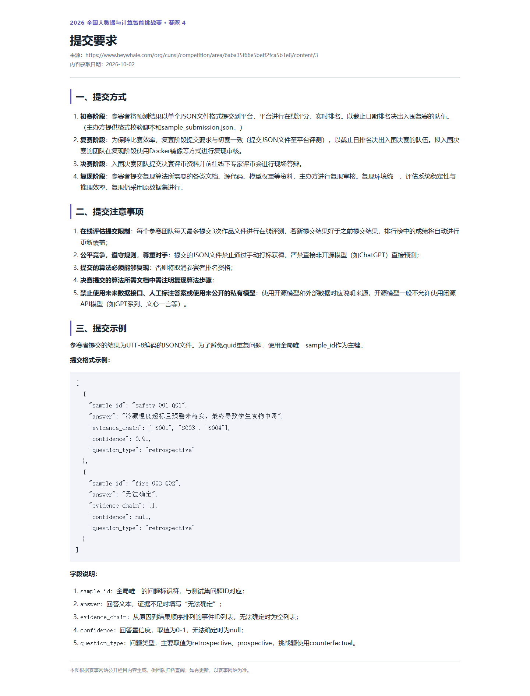
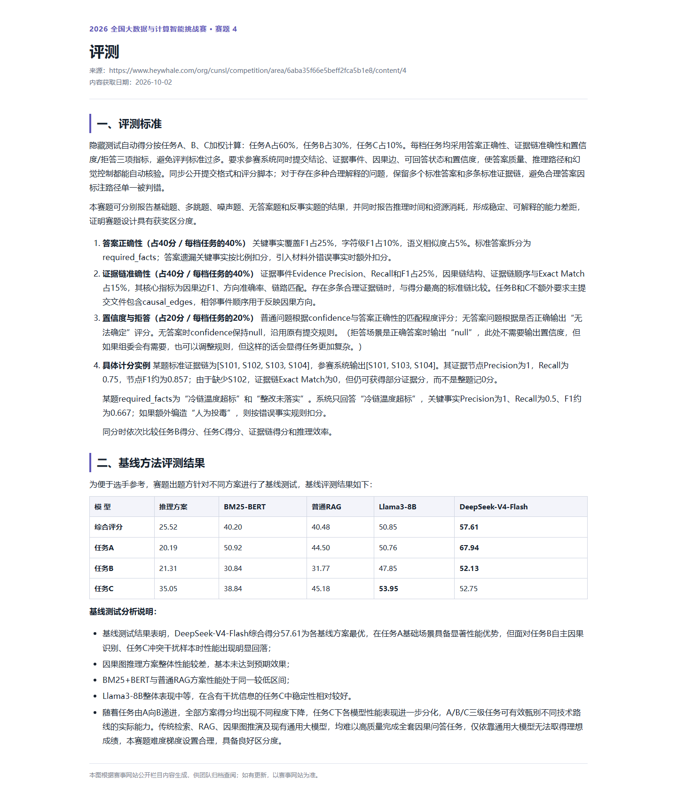
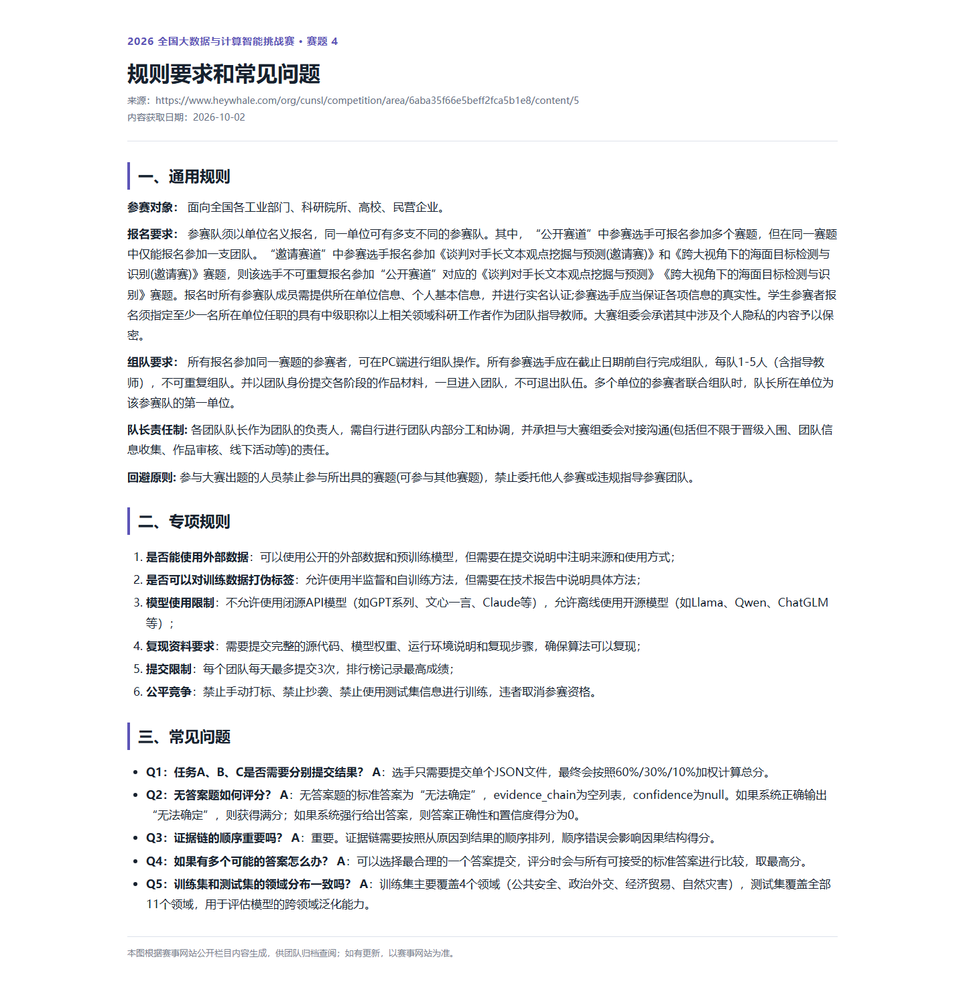

# 面向多源异构文档的事件因果链构建与证据约束推演

2026 大数据与计算智能挑战赛赛题 4 团队资料仓库。赛事截图保存于 **2026-10-02**；时间、规则和格式以[赛事页面](https://www.heywhale.com/org/cunsl/competition/area/6aba35f66e5beff2fca5b1e8/content/0)最新内容为准。

## 赛事入口与交流群

- [大赛官网](https://d2.nudt.edu.cn/tzs) · [赛题详情推文](https://mp.weixin.qq.com/s/NhCaa2aOPc789S-SWOLwbA) · [组委会 FAQ](https://dcnmzcw6gpr9.feishu.cn/share/base/view/shrcnghueQSnnSX7THcWfOVWCHb)
- 大赛已上线，请在官网报名组队；集中问题可先查 FAQ，其他问题可在群内提出。

赛事群通知原文：

> 1️⃣各位参赛的老师、同学，感谢大家的耐心等待，🔥 2026大数据与计算智能挑战赛正式上线！
>
> 官网：https://d2.nudt.edu.cn/tzs
>
> 👇 赛题详情请看推文，抓紧报名组队啦！推文链接：https://mp.weixin.qq.com/s/NhCaa2aOPc789S-SWOLwbA

> 2️⃣ 感谢各位老师、同学对本次大赛的支持和参与🌹🌹
>
> 针对大家集中咨询的问题，运营团队整理了一份FAQ，欢迎大家查阅，如有其他疑问可随时在群内提出。文档链接：https://dcnmzcw6gpr9.feishu.cn/share/base/view/shrcnghueQSnnSX7THcWfOVWCHb


## 赛题、数据与提交

目标是读取多篇文档，回答因果问题，并给出从原因到结果排列的证据事件 ID 和置信度。任务 A 给文档、事件列表和因果边，权重 **60%**；B 给文档和候选事件但需自行判断因果方向，权重 **30%**；C 涵盖事件抽取、反事实、冲突证据和无答案问题，权重 **10%**。[本地抽样测试集](数据集/抽样测试集_100/)共 A 210、B 350、C 200，合计 **760 题**。2026-10-04 收到的赛题 4 补充包中，494 份文档和 50 份问题文件与仓库已有文件逐字节一致，新增的 50 份 B 类事件列表已合并；C 类目前仍只有文档和问题，暂用文档 ID 作为候选证据 ID。

初赛提交单个 UTF-8 JSON 数组，网页示例的每题字段如下：

```json
[{"sample_id":"safety_001_Q01","answer":"冷藏温度超标且整改未落实，最终导致食物中毒","evidence_chain":["S001","S003","S004"],"confidence":0.91,"question_type":"retrospective"}]
```

无法确定时按网页示例写 `"answer":"无法确定"`、`"evidence_chain":[]`、`"confidence":null`。评测按答案正确性 **40%**、证据链准确性 **40%**、置信度与拒答 **20%** 计分；单个 JSON 覆盖 A/B/C。每天最多提交三次，算法和结果须可复现。规则要求符合条件的开源模型，禁止直接用闭源 API 生成正式参赛预测，也禁止人工标注测试答案。DeepSeek 托管 API 脚本仅作研究诊断。

**待平台澄清：** 当前数据存在 `question_type=unanswerable`，网页示例主要列出 `retrospective`、`prospective`、`counterfactual`。根据赛事问答中“无法回答题按 null 输出”的现有理解，程序将这类题的提交字段 `question_type` 写为 JSON `null`；输入题型仍保留给模型。训练集 937 道此类题中，有 93 道的金标答案含对错误前提或冲突的解释及非空证据链，因此代码不强制所有 `unanswerable` 都写成同一种拒答。此映射尚未通过平台反馈证实。

## 方法核查

模型无关的检索与核验探索、训练集证据覆盖审计及论文来源见[赛题 4 优化研究记录](docs/赛题4_模型无关优化研究_2026-10-04.md)。

这些代码依据公开描述**独立实现同类方法**。主办方未公开基线源代码、模型权重或提示词，不能声称复现其分数。

| 方法 | 实际使用 | 当前边界 |
| --- | --- | --- |
| `graph` | A 档给定有向因果边搜索路径，再从对应原文抽取相关句子作答 | B/C 无边时只保守定位单个事件；不能凭相关性杜撰因果边 |
| `bm25_bert` | 中文字符词 BM25（词频、IDF、长度归一化）加本地 BGE-small-zh-v1.5 BERT 编码器余弦相似度排序，复用图链与原文句子答案 | 真正使用 BM25 与 BERT 语义重排；并非 BERT 因果分类器 |
| `rag` | BM25 检索候选，保留题目点名和候选链涉及的文档，再交本地模型生成 | 真正先检索再生成；检索可能漏跨文档证据 |
| `llama3` | 全量材料送本地兼容接口或离线 Hugging Face 模型，复用统一校验 | 通用本地模型适配器；仓库没有 Llama3-8B 权重，未验证真正 Llama3-8B 效果 |
| `run_deepseek.py` | 全量材料送兼容 Chat Completions 接口，支持有序并发、格式修复和断点续跑 | 托管 API 仅作研究诊断，不作为正式提交路径 |

本地校验检查五个字段、证据 ID、拒答约束与 760 题覆盖。训练集诊断另算答案字符 F1、可选 BERT 语义相似度、证据节点/边和拒答正确率；这些指标可用于本地估分与方案比较，但细项实现不等于未公开的官方评分脚本。测试集没有标准答案，不能自行精确重算平台分数。2026-10-04 提交的 DeepSeek 研究输出获平台总分 **59.55**，A/B/C 为 **64.96/51.35/51.67**，按 60/30/10 加权一致。官方基线表中 DeepSeek 的 A/B/C 分数按公开权重计算为 61.68，却另列综合 57.61，口径待核实；详见[研究记录](docs/赛题4_模型无关优化研究_2026-10-04.md)。图方法和 BM25+BERT 已对补充后的 760 题全部生成并通过结构校验；训练集前 100 题的链完全匹配率分别为 0.46、0.45，未复现赛事表中 BM25+BERT 相对图方法的明显优势。RAG 接口在 B 类 3 题上生成合格 JSON；本地 Qwen2.5-0.5B-Instruct 实测输出不稳定，只靠保守拒答兜底通过结构校验，不能据此证明答案质量。

生成模型若连续两次输出无效 JSON 或答题时不附证据链，会记录日志并保守输出“无法确定”。模型输出的“无法确定：……”等无证据拒答会规范成完全一致的拒答格式。应统计这些兜底题并人工复核，不能把格式通过当作答题正确。

### 2026-10-04 本地实验

三种方法在补充后的 760 题上均生成了通过统一格式校验的 JSON。DeepSeek 托管 API 输出仅供研究，保存在本地忽略目录 `outputs/`，不作为正式参赛提交。用相同的前 100 道带金标训练题做本地诊断：

| 方法 | 答案字符 F1 | 答案 BERT 余弦 | 证据链完全匹配 | 证据节点 F1 | 证据边 F1 |
| --- | ---: | ---: | ---: | ---: | ---: |
| 图方法 | 0.374 | 0.718 | 0.460 | 0.737 | 0.590 |
| BM25+BERT | 0.373 | 0.722 | 0.450 | 0.732 | 0.573 |
| DeepSeek API | 0.456 | 0.829 | 0.500 | 0.848 | 0.706 |

这些代理指标显示 DeepSeek 总体领先，但图方法与 BM25+BERT 几乎并列，未复现官方基线表中的明显差距；在 14 道反事实训练题上，DeepSeek 的链完全匹配率 0.286 也低于图方法的 0.429。该 100 题切片不能代表盲测集，更不能换算官方分数。盲测集缺少金标；只有正式、符合规则的提交得到的平台反馈才能校准评分趋势。

DeepSeek 的盲测输出按 A/B/C 分别为 210/350/200 题，精确拒答 13/66/59 题，平均链长 4.04/2.66/2.44。A 类有 47 题的链存在未在给定边表中直接列出的相邻节点，需要复核；训练集金标中也存在这种跳跃，不能据此直接判错。运行日志记录 6 道因两次格式失败而保守拒答的题。

## 代码结构

| 位置 | 职责 |
| --- | --- |
| [`task4_core.py`](task4_core.py) | 发现题目、读取推理材料、构造输入、解析和校验统一提交格式、原子保存 |
| [`task4_api.py`](task4_api.py) | 兼容 Chat Completions 的 URL、Key、诊断和请求 |
| [`run_baselines.py`](run_baselines.py) | BM25、BERT 排序、图路径、RAG、本地模型与方法命令行 |
| [`run_deepseek.py`](run_deepseek.py) | DeepSeek/兼容接口的研究命令行，复用核心与接口代码 |
| [`evaluate_baselines.py`](evaluate_baselines.py) | 仅训练集诊断时读取标准答案，输出答案和证据链等代理指标；推理代码不读 `gold` |
| [`task4_workflow.py`](task4_workflow.py) · [`experiments/`](experiments/) | 证据提示、训练集检索与生成配对实验、公开权重核查；方法与局限见[研究记录](docs/赛题4_模型无关优化研究_2026-10-04.md) |
| `test_run_*.py` | 不需真实 Key 的测试 |
| [`数据集/`](数据集/) · `docs/赛事网页内容/` | 原始数据 · 六张赛事截图 |

## 运行

在仓库根目录用 Python 3.10+ 执行。默认只处理 3 题；`--limit 0` 表示所选范围全部题。输出放在已忽略的 `outputs/`；中断后用相同命令可从 `.partial` 续跑。

```powershell
python run_baselines.py --method graph --track all --limit 0 --output outputs/graph_760.json
python run_baselines.py --method graph --track all --limit 0 --validate outputs/graph_760.json
python run_baselines.py --method bm25_bert --track A --limit 3 --embedding-model models/bge-small-zh-v1.5 --output outputs/bm25_bert_a.json
python run_baselines.py --method rag --track A --limit 3 --local-hf-model models/YOUR_OPEN_MODEL --output outputs/rag_a.json
python run_baselines.py --method llama3 --track A --limit 3 --api-url http://127.0.0.1:8000/v1 --model YOUR_LOCAL_LLAMA3_MODEL --output outputs/llama3_a.json
python run_deepseek.py --dry-run --track A --limit 3
python run_deepseek.py --track all --limit 0 --workers 6 --output outputs/deepseek_research_760.json --api-url https://api.deepseek.com --model deepseek-flash --api-key-file C:/path/to/key.txt
python run_deepseek.py --track all --limit 0 --validate outputs/deepseek_research_760.json
python run_baselines.py --method graph --dataset 数据集/训练集 --track train --limit 100 --output outputs/graph_train_100.json
python evaluate_baselines.py --predictions outputs/graph_train_100.json --train-root 数据集/训练集
python evaluate_baselines.py --predictions outputs/graph_760.json --test-root 数据集/抽样测试集_100
python -m experiments.check_published_scores --a 64.96 --b 51.35 --c 51.67 --reported-total 59.55
python -m unittest -q test_run_deepseek.py test_run_baselines.py
```

`bm25_bert` 需要本地 [BAAI/bge-small-zh-v1.5](https://huggingface.co/BAAI/bge-small-zh-v1.5) 权重和 `sentence-transformers`；RAG 离线模式需要本地开源生成权重、`torch`、`transformers`。模型权重不在 Git 中。RAG 也可接已启动的本机 Chat Completions 服务（`--api-url`、`--model`）。DeepSeek 托管 API 的 Key 从交互输入或 `--api-key-file` 读取，不能提交 Key 或实验输出。完整研究运行可断点续跑，但托管 DeepSeek 结果不能作为正式参赛提交。

DeepSeek 官方[更新记录](https://api-docs.deepseek.com/updates/)说明：2026-09-10 起 `deepseek-flash` 指向 **V4.1 Flash**，旧 V4 Flash 已退役，旧别名也转接 V4.1。因此当前 API 实验与赛方公开的“DeepSeek-V4-Flash 57.61”并非同一模型版本，且测试集无金标，不能直接核对该分数。

## 赛事页面截图

以下图片保存于 2026-10-02；点击标题可看对应网页最新版本。

### [赛程安排](https://www.heywhale.com/org/cunsl/competition/area/6aba35f66e5beff2fca5b1e8/content/0)

初赛 9 月 30 日至 10 月 14 日；**10 月 4 日开启线上提交和评测**。复赛 10 月 15 日至 17 日，决赛 10 月 23 日。



### [赛题](https://www.heywhale.com/org/cunsl/competition/area/6aba35f66e5beff2fca5b1e8/content/1)



### [数据](https://www.heywhale.com/org/cunsl/competition/area/6aba35f66e5beff2fca5b1e8/content/2)



### [提交要求](https://www.heywhale.com/org/cunsl/competition/area/6aba35f66e5beff2fca5b1e8/content/3)



### [评测](https://www.heywhale.com/org/cunsl/competition/area/6aba35f66e5beff2fca5b1e8/content/4)



### [规则要求和常见问题](https://www.heywhale.com/org/cunsl/competition/area/6aba35f66e5beff2fca5b1e8/content/5)


