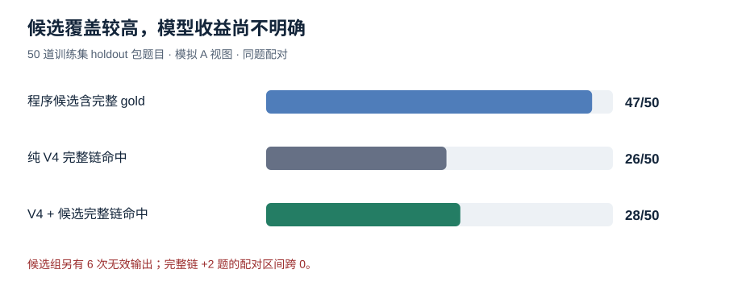

# 赛题4：A 类候选池与 DeepSeek V4 的 50 题配对实验

## 结论

程序候选池的**可用性**较高，但本轮把候选直接加入 V4 提示词，未形成明确的端到端提升。在预先冻结的 50 道 A 视图题上，候选前 5 条覆盖 47 道题的至少一条完整原始 gold 链；完整链命中由 26/50 升至 28/50（4 题改善、2 题退步，配对 bootstrap 95% 区间跨 0）。候选组有 6 次无效输出，纯 V4 组为 0 次；因此按全 50 题计，答案字符 F1、语义和节点 F1 均下降。这说明当前主要瓶颈已经从‘候选是否含金链’转到‘模型如何单选合法链及维持输出格式’，尚不能认定候选提示带来了稳定增益。

## 实验设置

- 数据：赛事训练集预先划分出的 98 个 holdout 材料包；50 道题来自 50 个不同包。仅用题面、事件和图按固定哈希抽题，未用 gold 选题。全部模拟 A 类视图，完整文档、事件、关系同时提供。
- 类型配额：明确完整路径 15、明确后续直接事件 15、两 ID 时间/因果判断 15、单 ID 不定方向直接因果 2、单事件事实 3。全部属于 retrospective；本子集没有严格拒答 gold，不能用于判断拒答方法的优劣。
- 模型：两组均为 DeepSeek Chat Completions 的 `deepseek-flash`，JSON mode，`max_tokens=8192`，未显式设置 temperature 或 reasoning_effort。两组的 V4 system prompt 完全相同，SHA-256 为 `6e4d5b5f162b0505a3912ebcd71af6d99850729b522cf70fead0fe218cf2eab5`。
- 唯一实验变量：候选组在相同原始 user 输入前增加下述短段与最多五条程序候选链；没有 ICL、二次调用、gold 或答案提示。候选不保证正确，允许模型否决或自行构链。

> 以下是程序依据当前材料中的有向因果图和问题生成的候选 evidence_chain，按相关性排序，仅供核对，不保证正确或完整。请以完整材料自行判断；可以选用、修正或否决候选并自行构建合法链。不要仅因候选存在就强行回答。
> 候选 evidence_chain：`[最多五条路径]`

## 程序候选池先验核查

两条局部规则：题面明确给出两个 ID 且询问时间/因果时，若图中存在所提顺序的有向边，优先展示该二节点候选；题面给出单 ID 并询问‘与哪一事件存在直接因果’时，优先展示该节点两侧被标为直接因果的边。规则只读输入，保留其他路径作为候选。

| 完整原始 gold 链前 5 命中 | 原 V2 | 局部 V3 | 新增/损失 |
|---|---:|---:|---:|
| fit 其他回溯题 | 1734/1957 | 1767/1957 | +33 / -0 |
| holdout 其他回溯题 | 206/223 | 207/223 | +1 / -0 |

其他题型在两次审计中均无命中变化；这是候选覆盖审计，不能代替模型作答实验。

## 50 题模型结果

| 指标（全 50 题，越高越好） | 纯 V4 | V4 + 候选 | 配对差值 95% 区间 |
|---|---:|---:|---:|
| 有效输出 | 50/50 | 44/50 | — |
| 答案字符 F1 | 0.4070 | 0.3586 | -0.0483 [-0.0936, -0.0083] |
| 答案语义余弦 | 0.7952 | 0.7023 | -0.0929 [-0.1717, -0.0259] |
| 证据节点 F1 | 0.8522 | 0.7614 | -0.0908 [-0.1691, -0.0256] |
| 有向边 F1 | 0.7121 | 0.6485 | -0.0636 [-0.1436, 0.0063] |
| 完整链命中 | 0.5200 | 0.5600 | 0.0400 [-0.0600, 0.1400] |

完整链配对：两组都中 24；仅候选组中 4；仅纯 V4 中 2；两组都不中 20。47/50 的候选召回并未转化为同等幅度的模型命中。

| 题型 | 题数 | 候选含完整 gold | 纯 V4 完整链 | 候选组完整链 | 候选组无效 |
|---|---:|---:|---:|---:|---:|
| 明确完整路径 | 15 | 14 | 8 | 11 | 3 |
| 明确后续直接事件 | 15 | 15 | 2 | 2 | 3 |
| 两 ID 时间/因果 | 15 | 13 | 12 | 11 | 0 |
| 单 ID 不定方向直接因果 | 2 | 2 | 1 | 1 | 0 |
| 单事件事实 | 3 | 3 | 3 | 3 | 0 |

### 有效题诊断（非主结果）

两组都有效的 44 题里，完整链为 25/44 → 28/44；答案字符 F1 为 0.4060 → 0.4075，语义余弦为 0.7948 → 0.7980。这些条件统计只能定位无效输出的影响，不能替代全 50 题结论。

### 明确的收益与损失

- `natural_disaster_124_Q01`：纯 V4 输出过长的 `D001-D002-D003-D004-D009`；候选组选择完整 gold 备选链 `D001-D003-D004-D009`。
- `natural_disaster_005_Q04`：纯 V4 缺少 gold 起点 `D002`；候选组改为 `D002-D001-D009-D010`，命中完整备选链。
- `diplomacy_134_Q02`：图上候选 `D004-D001` 正好是 gold，纯 V4 也给出该链；候选组反而只给 `D004`，并否定题目中的因果关系。这是模型根据原文复核后与标注不一致的实例，不能简单用候选强制覆盖。
- 6 次候选组无效中，3 次把多条候选照抄为二维 `evidence_chain`，3 次思考 token 耗尽后截断。原协议只允许一维单条链；无效按零计。

## 成本与判断

两组输入 token 分别为 427,275、433,405；输出含思考 token 分别为 96,009、132,343；请求耗时总和分别为 475.31 秒、664.21 秒。100 次请求的余额从 52.29 元到最后一次查询的 51.36 元，已显示扣费 0.93 元；账务可能滞后，因此这是当前可见扣费，不当作最终结算额。

**判断**：本轮不支持将当前候选提示直接替换纯 V4。继续研究时，先解决“候选池是多个可选链，但输出只能是一条链”的接口表达，并限制候选引发的额外思考/截断；之后再在新的冻结题集复验。不得用本 50 题的 gold 反向调候选或把无效输出事后修成有效。

详细的 50 题 gold、两组原答案、链和逐题分数见 [逐题对照](赛题4_A类候选池50题逐题对照_2026-10-10.md)。这些数字均为本地原始 gold 诊断，不是官方测试分数；没有使用 760 道无 gold 测试题调参或提交。
