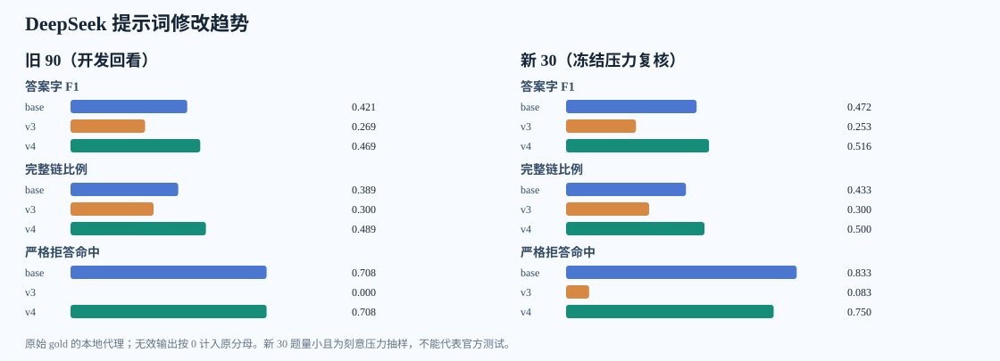

# DeepSeek V4 零示例提示词复核（2026-10-09）

## 实验口径

- 旧 90 题是 V4 设计时参考过的 fit 开发样本，仅看机制；新 30 题在调用前按固定哈希从隔离材料包冻结，六类各 5 题、A/B/C=18/9/3，是小型压力复核，不代表自然分布。
- 新 30 题的基础版、V3、V4 均对相同完整输入作答。旧 90 题只新跑 V4，基础版/V3 使用先前保存的 DeepSeek 输出。所有条件无 ICL，gold 只在输出完成后本地评分。
- 模型为 API 返回的 `deepseek-flash`；Chat Completions、JSON object、`max_tokens=8192`、默认温度/思考设置。V4 提示词全文及冻结哈希见[预注册](赛题4_DeepSeek_V4零示例复核_2026-10-09_预注册.md)。
- 原始 gold 备选链按完整单条匹配，不拼接。无效输出按原分母记 0。字符 F1、语义、事实覆盖及链指标均是本地代理指标，不是官方测试得分。严格拒答指 gold answer 恰为“无法确定”；其他含解释性未确定答案不计为严格拒答。
- [逐题横排对照](赛题4_DeepSeek_V4零示例复核_逐题横排_2026-10-09.html) 展示原始 gold 及三个提示词下的 answer、evidence_chain 与错误信息，不含新闻原文。

## 总体结果

| 样本 | 提示词 | 有效/题 | 答案字 F1 | 语义 | 事实覆盖 | 节点 F1 | 有向边 F1 | 完整链/题 | 严格拒答命中/应拒 | 误拒/非严格 | 输入/输出 token |
|---|---|---:|---:|---:|---:|---:|---:|---:|---:|---:|
| 旧 90 | 基础版 | 74/90 | 0.421 | 0.670 | 0.059 | 0.576 | 0.492 | 35/90 | 17/24 | 5/66 | 696,005/192,005 |
| 旧 90 | V3 | 80/90 | 0.269 | 0.655 | 0.000 | 0.492 | 0.480 | 27/90 | 0/24 | 0/66 | 777,635/247,343 |
| 旧 90 | V4 | 78/90 | 0.469 | 0.716 | 0.101 | 0.676 | 0.602 | 44/90 | 17/24 | 1/66 | 763,505/231,675 |
| 新 30 | 基础版 | 21/30 | 0.472 | 0.624 | 0.125 | 0.563 | 0.518 | 13/30 | 10/12 | 0/18 | 248,278/52,208 |
| 新 30 | V3 | 25/30 | 0.253 | 0.591 | 0.021 | 0.412 | 0.550 | 9/30 | 1/12 | 0/18 | 275,488/101,853 |
| 新 30 | V4 | 27/30 | 0.516 | 0.753 | 0.125 | 0.664 | 0.605 | 15/30 | 9/12 | 0/18 | 270,778/80,711 |

## 严格拒答与其他题

下表为输出后的 gold 分层，推理时没有用 gold 选择提示词。

| 样本 | gold 分组 | n | 基础版答案 F1 → V3 → V4 | 基础版完整链 → V3 → V4 | 基础版有效 → V3 → V4 |
|---|---|---:|---:|---:|---:|
| 旧 90 | 严格拒答 | 24 | 0.709 → 0.036 → 0.715 | 17 → 0 → 17 | 18 → 19 → 20 |
| 旧 90 | 其他 | 66 | 0.317 → 0.354 → 0.379 | 18 → 27 → 27 | 56 → 61 → 58 |
| 新 30 | 严格拒答 | 12 | 0.833 → 0.116 → 0.759 | 10 → 1 → 9 | 10 → 10 → 11 |
| 新 30 | 其他 | 18 | 0.231 → 0.343 → 0.355 | 3 → 8 → 6 | 11 → 15 → 16 |

## 同题配对变化

胜/负/平按右侧版本减左侧版本逐题计算；不能仅凭均值判断有多少题改善。

| 样本 | 对照 | 答案字 F1 胜/负/平 | 节点 F1 胜/负/平 | 完整链胜/负/平 |
|---|---|---:|---:|---:|
| 旧 90 | base → v3 | 33/54/3 | 24/24/42 | 11/19/60 |
| 旧 90 | v3 → v4 | 64/19/7 | 32/10/48 | 21/4/65 |
| 旧 90 | base → v4 | 44/28/18 | 30/13/47 | 16/7/67 |
| 新 30 | base → v3 | 10/17/3 | 8/12/10 | 6/10/14 |
| 新 30 | v3 → v4 | 23/4/3 | 11/5/14 | 8/2/20 |
| 新 30 | base → v4 | 13/7/10 | 6/6/18 | 5/3/22 |

## 新 30 题的类别变化

每类只有 5 题；表中链为完整链命中题数，提醒读者不要放大单题波动。

| 类别 | n | 基础版答案 F1 → V3 → V4 | 完整链数：基础版 → V3 → V4 | 有效数：基础版 → V3 → V4 |
|---|---:|---:|---:|---:|
| 来源冲突 | 5 | 0.524 → 0.205 → 0.468 | 2 → 1 → 2 | 3 → 3 → 4 |
| 干扰排除 | 5 | 0.094 → 0.333 → 0.337 | 0 → 3 → 3 | 1 → 4 → 4 |
| 有据预测 | 5 | 0.263 → 0.153 → 0.246 | 1 → 0 → 0 | 5 → 3 → 5 |
| 信息缺失 | 5 | 0.800 → 0.381 → 0.800 | 4 → 2 → 4 | 4 → 5 → 4 |
| 多跳因果 | 5 | 0.349 → 0.407 → 0.443 | 2 → 3 → 2 | 4 → 5 → 5 |
| 不可回答 | 5 | 0.800 → 0.035 → 0.806 | 4 → 0 → 4 | 4 → 5 → 5 |

## 最大正负变化案例

每组按（答案字 F1 + 节点 F1 + 完整链）的 V4−V3 差值统一排序，各列最好和最差各取一题；负例照录。

| 样本 | 最好变化 | 最差变化 |
|---|---|---|
| 旧 90 | [public_safety_067_Q02](赛题4_DeepSeek_V4零示例复核_逐题横排_2026-10-09.html#public_safety_067_Q02) (+3.00) | [diplomacy_197_Q03](赛题4_DeepSeek_V4零示例复核_逐题横排_2026-10-09.html#diplomacy_197_Q03) (-2.54) |
| 新 30 | [energy_environment_04_Q02](赛题4_DeepSeek_V4零示例复核_逐题横排_2026-10-09.html#energy_environment_04_Q02) (+3.00) | [economy_trade_074_Q09](赛题4_DeepSeek_V4零示例复核_逐题横排_2026-10-09.html#economy_trade_074_Q09) (-2.71) |

## 请求、用量和费用

- 本轮新发起 180 次 DeepSeek 请求：旧 90 题只跑 V4，新 30 题三种提示词各跑一次。账户余额快照 ¥6.87 → ¥3.66，截至 2026-10-09T13:31:12.100447+00:00 观察到下降 ¥3.21。余额结算可能延迟，且账户若有其他流量，此数不能视为逐请求精确费用。
- 上表 token 为各条件 API 返回的计数；旧 90 题的基础版和 V3 是先前调用的用量，不能计入本轮 180 次费用。耗时与 token 的逐题记录在原始请求日志。

## 结果解释与保留的负例

- **V4 对 V3 的修复方向明确，但新 30 题上相对基础版的增量很小。** V3 在严格拒答题把解释缺口写成有链回答；V4 恢复了旧 90 题的 17/24 和新 30 题的 9/12，而基础版分别是 17/24 和 10/12。新 30 题的答案字符 F1 为基础版 0.472、V3 0.253、V4 0.517；完整链为 13、9、15 题。逐题对基础版，V4 答案胜/负/平 13/7/10，完整链 5/3/22。这个样本不能证明稳定泛化或官方得分提升。
- **V4 没有把非严格题的链做好。** 新 30 题中非严格 18 题，V4 的答案 F1 为 0.355，较 V3 的 0.343 略高、基础版 0.231 较高；但完整链仅 6/18，低于 V3 的 8/18。干扰排除保持 V3 的 3/5，多跳因果由 V3 的 3/5 降到 2/5；有据预测三者均只有 0 或 1 条完整链。不能把有向边 F1 上升直接解释为全链正确。
- **边界仍会错判。** `natural_disaster_162_Q05` 的 gold 是严格“无法确定”加空链，基础版答对，V4 却写成不能精确量化的解释并给了两个节点。`economy_trade_074_Q09` 的 gold 是依据单节点说明方案内容未知，V3 的链命中，V4 输出非拒答答案却留空链，被原解析协议判无效。`transportation_03_Q04` 的 gold 预测链有 10 个节点，基础版全链命中，V4 只给 5 个节点且顺序不同。
- V4 旧 90 题有效 78/90，少于 V3 的 80/90；其中 6 个请求达到输出上限，6 个非拒答答案留空链。新 30 题 V4 有效 27/30，3 个无效均为非拒答答案留空链。V4 没有出现非法 ID，但这不是格式问题完全解决的证据。所有无效输出仍在原分母中计 0，并在横排页保留原文。
- 结论只支持把 V4 作为下一轮候选提示词。新 30 题虽与旧样本按材料包和规范化文档隔离，仍来自 fit、刻意偏向六类压力题，严格拒答占 12/30；后续需要在未用于写提示词的 validation 冻结集检验，并按真实分布核对。

本轮未调用 GPT，未使用 ICL，未用无 gold 的测试集调参，未向赛事平台提交；DeepSeek 输出仅用于研究对照。
