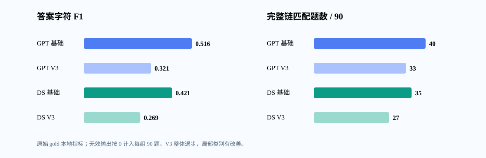

# 九类问题 90 题：双模型基础版与合并规则 V3 配对实验（2026-10-09）

## 实验设置与口径

- 已冻结 fit 90 题；九类各 10 题，每类 A/B/C = 6/3/1。两模型每题分别收到相同完整材料和当前问题；仅 system 提示词不同。无 ICL。`track` 与 `reasoning_type` 不发送给模型，gold 仅在输出后本地评分。
- GPT 端点请求名 `gpt-6-sol`，DeepSeek 请求名 `deepseek-flash`；两端均用 Chat Completions、JSON object、`max_tokens=8192`、默认温度与默认推理设置。基础版是最早提示词的 A/B/C 字样中性化版本；V3 同时增加问答和证据链规则。提示词全文见预注册文档与实验目录。
- 下列数值是**原始 gold 的本地代理指标**，不是赛事官方分数。语义相似度不能按单一阈值认定逐题对错；`required_facts` 只是字面覆盖代理。备选链按完整原链匹配，未拼接。无效输出在 90 题分母中记 0。
- [逐题横排对照](赛题4_九类问题90题_逐题横排对照_2026-10-09.html) 可按问题类型和档位筛选，展示 gold、两模型两提示词的 answer 与 evidence_chain，未包含新闻原文。

## 总体结果

| 模型 | 提示词 | 有效/90 | 答案字 F1 | 语义 | 关键事实覆盖 | 节点 F1 | 有向边 F1 | 完整链/90 | 严格拒答判别 | 输入/输出 token |
|---|---|---:|---:|---:|---:|---:|---:|---:|---:|---:|
| GPT-6 Sol | 基础版 | 87/90 | 0.516 | 0.778 | 0.106 | 0.667 | 0.568 | 40 | 0.878 | 1,224,690/16,482 |
| GPT-6 Sol | 合并规则 V3 | 87/90 | 0.321 | 0.702 | 0.013 | 0.548 | 0.662 | 33 | 0.733 | 1,421,230/21,069 |
| DeepSeek Flash | 基础版 | 74/90 | 0.421 | 0.670 | 0.059 | 0.576 | 0.492 | 35 | 0.756 | 696,005/192,005 |
| DeepSeek Flash | 合并规则 V3 | 80/90 | 0.269 | 0.655 | 0.000 | 0.492 | 0.480 | 27 | 0.678 | 777,635/247,343 |

### 严格拒答与其他题的诊断拆分

这一步是在模型输出完成后按原始 gold 分组，仅用于解释失败；推理时不能读取 gold 来选提示词。本子集严格拒答题 24/90，其他题 66/90。

| 模型 | gold 分组 | N | 基础版答案 F1 → V3 | 基础版完整链 → V3 | 模型严格拒答数：基础版 → V3 |
|---|---|---:|---:|---:|---:|
| GPT-6 Sol | 严格拒答 | 24 | 0.958 → 0.062 | 23 → 0 | 23 → 0 |
| GPT-6 Sol | 其他 | 66 | 0.355 → 0.415 | 17 → 33 | 8 → 0 |
| DeepSeek Flash | 严格拒答 | 24 | 0.709 → 0.036 | 17 → 0 | 17 → 0 |
| DeepSeek Flash | 其他 | 66 | 0.317 → 0.354 | 18 → 27 | 5 → 0 |

表中最后一列在严格拒答组是命中数，在其他组是误拒数。非严格组的改善不能直接转换为部署策略，因为实际作答时不知道 gold 分组。严格拒答在本诊断样本中占 26.7%，高于其在全量训练集中的自然占比；本轮九类型均衡抽样，因此总体均值也不代表全量训练集或测试集分布。空 gold 链与单节点预测链都没有有向边，边 F1 可能显示为 1，不能单凭边 F1 判断拒答或完整链正确。

### 同题配对变化

| 模型 | 答案字 F1：V3 胜/负/平 | 节点 F1：胜/负/平 | 完整链：胜/负/平 |
|---|---:|---:|---:|
| GPT-6 Sol | 43/46/1 | 34/31/25 | 18/25/47 |
| DeepSeek Flash | 33/54/3 | 24/24/42 | 11/19/60 |

## 九类分层

每类仅 10 题，数字为 V3 减基础版；链为完整链匹配题数变化。

| 问题类型 | GPT 答案 F1 Δ | GPT 完整链 Δ | GPT 有效 Δ | DS 答案 F1 Δ | DS 完整链 Δ | DS 有效 Δ |
|---|---:|---:|---:|---:|---:|---:|
| 来源冲突 (`conflicting_sources`) | -0.407 | -3 | -2 | -0.471 | -4 | -4 |
| 干扰排除 (`distractor_robustness`) | +0.093 | +4 | +2 | +0.135 | +4 | +4 |
| 信息缺失 (`missing_information`) | -0.645 | -6 | +0 | -0.541 | -6 | +1 |
| 不可回答 (`unanswerable`) | -0.937 | -10 | +0 | -0.472 | -5 | +5 |
| 时序因果 (`temporal_causal`) | +0.018 | +1 | +0 | +0.099 | +3 | +1 |
| 反事实 (`counterfactual`) | -0.009 | +1 | +0 | +0.063 | +0 | +0 |
| 有据预测 (`grounded_pred`) | -0.023 | +0 | +0 | -0.012 | +0 | +1 |
| 单跳因果 (`single_hop`) | +0.101 | +1 | +0 | -0.062 | +1 | +0 |
| 多跳因果 (`multi_hop_causal`) | +0.053 | +5 | +0 | -0.107 | -1 | -2 |

## 按 A/B/C 档位核对

| 模型 | 档位 | N | 基础版答案 F1 | V3 答案 F1 | 基础版完整链 | V3 完整链 |
|---|---|---:|---:|---:|---:|---:|
| GPT-6 Sol | A | 54 | 0.514 | 0.291 | 26 | 23 |
| GPT-6 Sol | B | 27 | 0.505 | 0.357 | 11 | 10 |
| GPT-6 Sol | C | 9 | 0.562 | 0.388 | 3 | 0 |
| DeepSeek Flash | A | 54 | 0.439 | 0.251 | 23 | 16 |
| DeepSeek Flash | B | 27 | 0.355 | 0.297 | 10 | 10 |
| DeepSeek Flash | C | 9 | 0.517 | 0.296 | 2 | 1 |

## 代表性变化与失败例

下表对每类使用预定的配对指标差（答案字 F1 + 节点 F1 + 完整链）选出 **V3 最好与最差** 的各一题；选择规则对所有类别相同，负例不删除。链接打开逐题横排对照。

| 类别 | 模型 | 最大改善 | 最大退步 |
|---|---|---|---|
| 来源冲突 | GPT | [economy_trade_085_Q05](赛题4_九类问题90题_逐题横排对照_2026-10-09.html#economy_trade_085_Q05) (+2.55) | [diplomacy_014_Q08](赛题4_九类问题90题_逐题横排对照_2026-10-09.html#diplomacy_014_Q08) (-3.00) |
| 来源冲突 | DS | [natural_disaster_060_Q05](赛题4_九类问题90题_逐题横排对照_2026-10-09.html#natural_disaster_060_Q05) (+1.34) | [diplomacy_014_Q08](赛题4_九类问题90题_逐题横排对照_2026-10-09.html#diplomacy_014_Q08) (-3.00) |
| 干扰排除 | GPT | [public_safety_059_Q09](赛题4_九类问题90题_逐题横排对照_2026-10-09.html#public_safety_059_Q09) (+2.34) | [diplomacy_045_Q08](赛题4_九类问题90题_逐题横排对照_2026-10-09.html#diplomacy_045_Q08) (-0.45) |
| 干扰排除 | DS | [natural_disaster_079_Q08](赛题4_九类问题90题_逐题横排对照_2026-10-09.html#natural_disaster_079_Q08) (+2.61) | [diplomacy_045_Q08](赛题4_九类问题90题_逐题横排对照_2026-10-09.html#diplomacy_045_Q08) (-0.40) |
| 信息缺失 | GPT | [public_safety_034_Q09](赛题4_九类问题90题_逐题横排对照_2026-10-09.html#public_safety_034_Q09) (+2.48) | [public_safety_049_Q09](赛题4_九类问题90题_逐题横排对照_2026-10-09.html#public_safety_049_Q09) (-2.97) |
| 信息缺失 | DS | [diplomacy_104_Q09](赛题4_九类问题90题_逐题横排对照_2026-10-09.html#diplomacy_104_Q09) (+2.52) | [economy_trade_022_Q09](赛题4_九类问题90题_逐题横排对照_2026-10-09.html#economy_trade_022_Q09) (-2.97) |
| 不可回答 | GPT | [diplomacy_060_Q05](赛题4_九类问题90题_逐题横排对照_2026-10-09.html#diplomacy_060_Q05) (-2.91) | [public_safety_067_Q02](赛题4_九类问题90题_逐题横排对照_2026-10-09.html#public_safety_067_Q02) (-3.00) |
| 不可回答 | DS | [public_safety_017_Q05](赛题4_九类问题90题_逐题横排对照_2026-10-09.html#public_safety_017_Q05) (+0.04) | [public_safety_067_Q02](赛题4_九类问题90题_逐题横排对照_2026-10-09.html#public_safety_067_Q02) (-3.00) |
| 时序因果 | GPT | [economy_trade_198_Q02](赛题4_九类问题90题_逐题横排对照_2026-10-09.html#economy_trade_198_Q02) (+2.29) | [natural_disaster_062_Q04](赛题4_九类问题90题_逐题横排对照_2026-10-09.html#natural_disaster_062_Q04) (-1.74) |
| 时序因果 | DS | [diplomacy_197_Q03](赛题4_九类问题90题_逐题横排对照_2026-10-09.html#diplomacy_197_Q03) (+2.54) | [diplomacy_003_Q02](赛题4_九类问题90题_逐题横排对照_2026-10-09.html#diplomacy_003_Q02) (-0.07) |
| 反事实 | GPT | [natural_disaster_199_Q03](赛题4_九类问题90题_逐题横排对照_2026-10-09.html#natural_disaster_199_Q03) (+1.19) | [economy_trade_053_Q03](赛题4_九类问题90题_逐题横排对照_2026-10-09.html#economy_trade_053_Q03) (-1.20) |
| 反事实 | DS | [public_safety_056_Q03](赛题4_九类问题90题_逐题横排对照_2026-10-09.html#public_safety_056_Q03) (+1.71) | [public_safety_121_Q03](赛题4_九类问题90题_逐题横排对照_2026-10-09.html#public_safety_121_Q03) (-1.49) |
| 有据预测 | GPT | [economy_trade_018_Q07](赛题4_九类问题90题_逐题横排对照_2026-10-09.html#economy_trade_018_Q07) (+0.38) | [public_safety_127_Q07](赛题4_九类问题90题_逐题横排对照_2026-10-09.html#public_safety_127_Q07) (-0.43) |
| 有据预测 | DS | [public_safety_127_Q07](赛题4_九类问题90题_逐题横排对照_2026-10-09.html#public_safety_127_Q07) (+0.91) | [public_safety_132_Q07](赛题4_九类问题90题_逐题横排对照_2026-10-09.html#public_safety_132_Q07) (-0.91) |
| 单跳因果 | GPT | [technology_governance_02_Q04](赛题4_九类问题90题_逐题横排对照_2026-10-09.html#technology_governance_02_Q04) (+1.35) | [natural_disaster_157_Q04](赛题4_九类问题90题_逐题横排对照_2026-10-09.html#natural_disaster_157_Q04) (-0.14) |
| 单跳因果 | DS | [public_safety_250_Q03](赛题4_九类问题90题_逐题横排对照_2026-10-09.html#public_safety_250_Q03) (+1.33) | [technology_governance_02_Q04](赛题4_九类问题90题_逐题横排对照_2026-10-09.html#technology_governance_02_Q04) (-0.20) |
| 多跳因果 | GPT | [economy_trade_034_Q04](赛题4_九类问题90题_逐题横排对照_2026-10-09.html#economy_trade_034_Q04) (+2.37) | [natural_disaster_169_Q07](赛题4_九类问题90题_逐题横排对照_2026-10-09.html#natural_disaster_169_Q07) (-0.21) |
| 多跳因果 | DS | [energy_environment_06_Q07](赛题4_九类问题90题_逐题横排对照_2026-10-09.html#energy_environment_06_Q07) (+0.02) | [public_safety_204_Q01](赛题4_九类问题90题_逐题横排对照_2026-10-09.html#public_safety_204_Q01) (-2.31) |

## 费用、时间与结论边界

- GPT-6 Sol：请求 180 次；响应模型 gpt-6-sol；基础版累计接口耗时 1679.6 秒，V3 2028.7 秒。这是请求耗时之和，不是并行墙钟时间。账户余额 7.35532301 → 6.54652351 USD，截至 2026-10-09 11:37:14 UTC 扣费 0.80879950 USD。
- DeepSeek Flash：请求 180 次；响应模型 deepseek-flash；基础版累计接口耗时 910.1 秒，V3 1206.3 秒。这是请求耗时之和，不是并行墙钟时间。账户余额 10.00 → 6.87 CNY，截至 2026-10-09 11:37:14 UTC 扣费 3.13 CNY。

## 结论与失败机制

- **本轮 V3 不能判定为整体提升。** GPT 的答案字符 F1 从 0.516 降至 0.321，完整链从 40/90 降至 33/90；DeepSeek 分别从 0.421 降至 0.269、从 35/90 降至 27/90。即使只看有效输出，答案 F1 也分别为 GPT 0.534→0.332、DeepSeek 0.513→0.303。GPT 的有向边 F1 反而从 0.568 升至 0.662，说明部分局部连边可能更准，但完整路径和答案并未同步改善。
- 退步集中在严格拒答场景：本冻结子集的 `unanswerable` 10 题 gold 全是严格“无法确定”加空链，`missing_information` 10 题中 8 题如此；V3 过度鼓励“有依据的限定解释”，使两模型在这两类的答案与完整链大幅下降。这个观察只针对冻结子集，不能推广为所有同类题都该拒答。
- V3 有局部收益：干扰排除的完整链两模型均增加 4 题；时序因果分别增加 1 和 3 题；GPT 多跳因果增加 5 题。但这些收益抵不过拒答类损失。DeepSeek 的有效格式数从 74 增至 80，GPT 均为 87；格式改善也不等于答案改善。
- 无效原因有结构差异：GPT 基础版的 3 个无效输出，以及 DeepSeek 基础版 16 个无效输出中的 13 个，都是非严格回答却留空 evidence_chain；DeepSeek 基础版另有 3 个截断。V3 的 GPT 有 3 个、DeepSeek 有 6 个输出把文档 ID（如 `D011`）当作可用事件 ID，违反了有事件列表时只用 event_id 的协议；DeepSeek V3 另有 4 个 8192 token 截断。原始输出和失败信息都在逐题页与请求日志。
- 这说明下一版规则应先细分严格拒答与“可给限定解释”的可判别条件，并强化事件 ID 合法性。应先在当前冻结题上做错误归因与拟议规则检查，**不能把本轮负结果当成改题或改分母的理由**；若产生 V4，需要另用未碰过的样本验证。

90 题为 fit 探索样本，C 档仅 9 题；不能据此声称测试集/官方分数改善，也不能把提示词的问答规则与证据链规则分开归因。两提供商的 token 统计口径与缓存可能不同，不能仅比较 token 数来判断模型效率。托管输出仅作研究对照，不进入训练或正式参赛预测。
