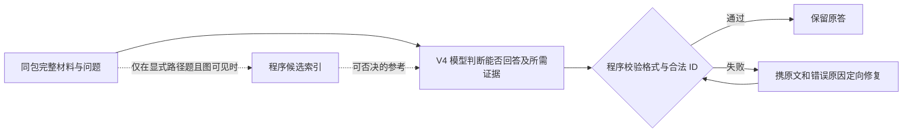

# 证据链与严格拒答：提示词还是程序辅助？（2026-10-10）

## 先说结论

**当前应保留 V4 作为默认语义决策，程序只做确定性的结构校验；现有程序候选路径不能直接加入默认提示词。** 这不是排除代码方法，而是把代码的职责限制在它能验证的事情：JSON 字段、合法 ID、重复节点、拒答三字段一致性、可见关系的方向和类型。是否应严格拒答、某条路径是否回答了这道题，仍需要核对原文与问法，不能只看标签、图连边或链长。

新做的 12 题同题试点中，第二次模型复核几乎没有改变整链和拒答；把当前程序的前五条图路径加给 A 档复核反而变差。因此现在不能说“程序＋大模型”比纯 V4 好。完整原始输出与 gold 横排：[12 题对照](赛题4_V4提示词与代码辅助_12题逐题横排_2026-10-10.html)；[冻结和判据](赛题4_V4提示词与代码辅助复核_2026-10-10_预注册.md)。

## 为什么要把两种错误分开

上一轮新冻结 30 题，DeepSeek V4 比 V3 把严格拒答命中从 **1/12 提至 9/12**，答案字符 F1 从 **0.253 提至 0.517**，完整链从 **9/30 提至 15/30**。但它相对基础版只是小幅改善：基础版严格拒答 **10/12**、完整链 **13/30**。在 18 道 gold 非严格拒答题上，V4 完整链只有 **6/18**，低于 V3 的 **8/18**。三道 V4 输出是“有答案、空链”，被原解析器判无效。

严格拒答不能简单交给关键词程序。全量原始训练集里，`unanswerable` 的 937 题中 **844** 道 gold 精确写“无法确定”且空链，另 **93** 道要纠错前提、排除干扰或解释证据缺口，gold 是非空链。严格拒答还出现在别的问题类型。因此 `question_type=unanswerable` 不等于强制拒答，`answer` 中出现“无法精确”也不总等于应清空证据链。程序适合保证**已经决定拒答后**的三字段格式，不适合替模型作这个语义决定。

证据链也不能只用图规则锁死。全量 gold 的 33,510 个相邻步骤里，9,657 个是原图标注的“间接传导”；789 题至少有一条 gold 链含原图未列的步骤。有些题的证据序列不是完整的因果路径，B/C 输入还缺少关系图。强制“每一步必须是显式直接边”、一律选最短路、或自动把间接边展开，都会误伤原始 gold。

## 已有代码路径研究与本次 V4 试点

早期 A 档研究在 **23** 道题上，原始输入与“程序路径索引＋完整原文”两臂的完整链是 **10/23 → 13/23**；第二批 **11** 道为 **5/11 → 5/11**。提示词与样本均不同于 V4，证明候选路径**有时**有帮助，不能证明它适合当前规则或全部题。

本次在调用前按材料包与规范化文档隔离，冻结 **12 道 fit 题**，六类问题各两题，A/B/C=6/3/3；选题不看 gold。三臂均收到同包完整材料，且不把 gold、`reasoning_type` 发给模型：

| 对照 | 额外操作 | 新请求 |
|---|---|---:|
| V4 原答 | 一次 DeepSeek 调用 | 12 |
| V4＋模型复核 | 同一份初稿，完整材料再交模型核对答法和链 | 12 |
| V4＋程序候选复核 | 只在 6 道 A 档，把可见图的前五条候选路径与原边类型、原文摘录加入同样复核；B/C 沿用上一臂 | 6 |

三个条件均用 `deepseek-flash`、原三字段 JSON 协议、`max_tokens=8192`，没有 ICL。程序候选明确标为“不是标准答案，可全部否决”。全部 30 次调用成功完成，12 题各臂输出都通过原解析器。下面均是**原始完整 gold 的本地代理评分**，无效输出按原分母计 0，但本批恰无无效输出。

| 比较范围 | 条件 | 答案字 F1 | 语义 | 节点 F1 | 有向边 F1 | 完整链 | 严格拒答命中 |
|---|---|---:|---:|---:|---:|---:|---:|
| 全 12 | V4 | 0.470 | 0.791 | 0.587 | 0.553 | 3/12 | 2/3 |
| 全 12 | V4＋模型复核 | 0.481 | 0.796 | 0.587 | 0.553 | 3/12 | 2/3 |
| A 档 6 | V4 | 0.477 | 0.806 | 0.611 | 0.429 | 1/6 | 1/2 |
| A 档 6 | V4＋模型复核 | 0.497 | 0.814 | 0.611 | 0.429 | 1/6 | 1/2 |
| A 档 6 | V4＋程序候选复核 | **0.327** | **0.714** | **0.444** | **0.262** | **0/6** | **0/2** |

全 12 题，模型复核相对 V4 的答案字符 F1 逐题是 **5 胜、0 负、7 平**，但节点、边与完整链的平均值完全不动；这一点增量不足以支持把每题都改为两次调用。A 档程序候选相对普通模型复核是 **1 胜、4 负、1 平**，整链从 1/6 降为 0/6。A 档两题 gold 本就应为空链，程序却仍生成图路径；在其余四道非严格拒答题中，前五条候选只有 **1/4** 题包含某一条完整 gold 备选链。候选覆盖率不足，模型也没有在唯一覆盖题选中该链。

两个代表性负例：

- [`economy_trade_201_Q05`](赛题4_V4提示词与代码辅助_12题逐题横排_2026-10-10.html#economy_trade_201_Q05) 问未来五年影响能否精确量化。gold 和 V4/普通复核均为严格“无法确定”、空链；加入图路径候选后，模型改成解释性答案和非空链。它回答了相近的“为什么不能量化”，却偏离本题的原始 gold 答法。
- [`natural_disaster_085_Q01`](赛题4_V4提示词与代码辅助_12题逐题横排_2026-10-10.html#natural_disaster_085_Q01) 要多阶段完整链，gold 有五条完整备选链。程序候选里已有一条命中，但模型仍混入并行阶段，三个条件都未整链命中。**候选覆盖不等于最终选择正确**。

## 怎样分工，以及下一步验证什么

1. **保留的硬约束：** JSON 三字段、ID 必须来自当前输入、不得重复；严格 `answer="无法确定"` 时必须空链和 `confidence=null`。这些检查在 `task4_core.py` 的解析器中大部分**已经实现**，不应把这部分已有收益误记成新候选算法的贡献。对无效输出可单独试定向修复，并与“直接重试一次”作同成本对照。
2. **暂不写死的语义规则：** 不根据 `question_type`、答案中的否定词、图缺边或最短路径强制拒答、清空或改写链。它们会误伤有依据的限定解释、间接传导和长链过程。
3. **候选路径需要先改进和筛选适用题。** 先在与开发样本隔离的有 gold fit 子集做候选**召回审计**：明确按严格拒答、单节点解释、因果过程、预测分别计算“前 K 候选含任一完整 gold 链”的比例；对图缺步和 B/C 只给原文锚点，不伪造图路径。只有候选覆盖与严格拒答安全性达到预设门槛，才做下一次同题模型调用对照。当前版本没有通过这一步。
4. **二次模型复核宜按错误触发，而非每题必跑。** 本试点所有 V4 原答都有效，全面复核未改变链或拒答；若后续只对格式错误、非法 ID 或链与答案明显冲突的输出触发，应另做同题对照并计算触发率、修复率和额外 token/时间。

这轮 30 次请求共计输入 **246,729**、输出 **63,146** token，请求耗时合计 **344.9 秒**（并发执行，非墙钟时间）。开始时余额 ¥3.58，进程结束快照 ¥3.44；随后余额升至约 ¥53.1，显示账户有额外余额变动，**不能用余额差精确归因本轮费用**。原始调用与逐题评分保存在 `outputs/v4_hybrid12_20261010/`。12 题太少，严格拒答仅 3 题；这只是方向筛查，不能用作统计显著性或官方测试得分。没有使用 760 道无 gold 测试题调参或提交；托管输出不进入训练。
